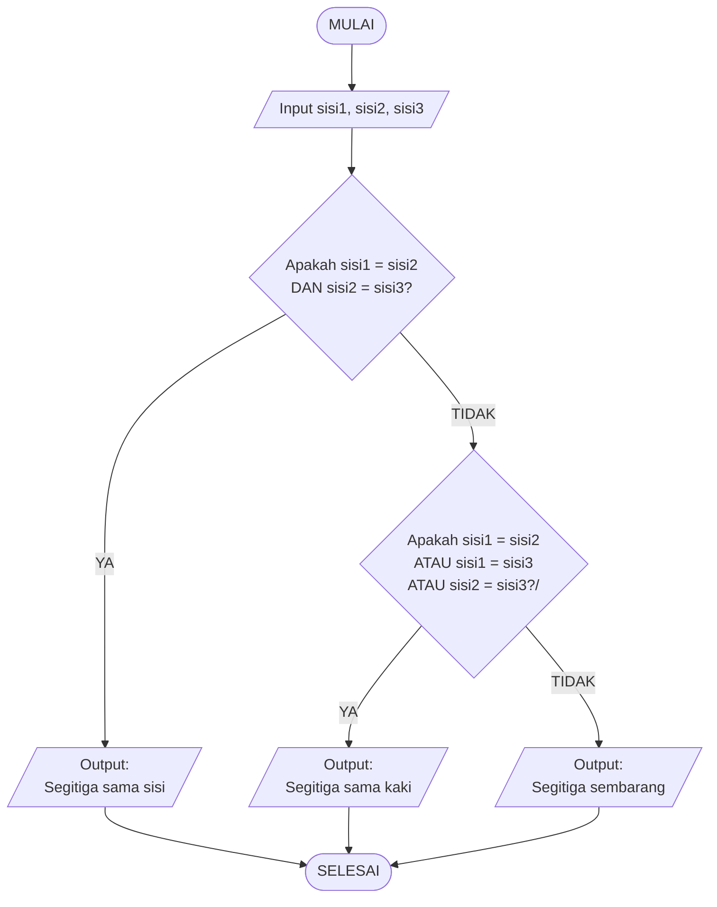

## 📥 Input – Proses – Output

| **Komponen** | **Keterangan** |
|---|---|
| **Input** | • Panjang sisi pertama. • Panjang sisi kedua. • Panjang sisi ketiga. |
| **Proses** | Program membandingkan panjang ketiga sisi menggunakan kondisi logika:  • Jika sisi 1 = sisi 2 **dan** sisi 2 = sisi 3, maka segitiga sama sisi. • Jika sisi 1 = sisi 2 **atau** sisi 1 = sisi 3 **atau** sisi 2 = sisi 3, maka segitiga sama kaki. • Jika semua sisi berbeda, maka segitiga sembarang. |
| **Output** | Jenis segitiga berdasarkan panjang sisi. |
